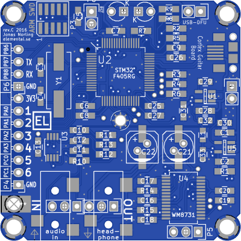
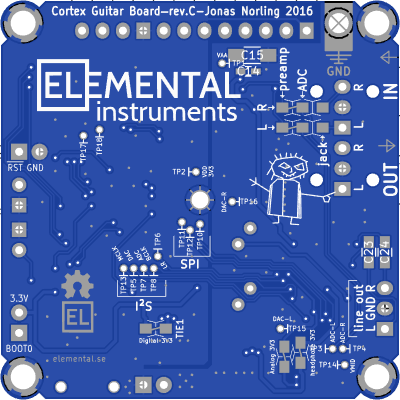

The Cortex Guitar Board
=======================

This is a Cortex-M4 DSP board for development of audio DSP
applications such as Guitar effects.

This repository contains the hardware design as KiCAD files and sample
software that implements some naive guitar effects. For info about the
software and how to load it, look at [fw/README.md](fw/README.md). For
more on the hardware, keep on reading below and also look in
[hw/README.md](hw/README.md).

The board is based on a STM32F405RG microcontroller (192KiB RAM,
Cortex-M4 with DSP and floating point instructions) and a WM8731 audio
codec.

About the hardware
------------------

### Audio chain

The stereo audio input is pre-amplified in an opamp before the signal
reaches the ADC. This step is required to get a high input impedance
suitable for connecting to an electric guitar or other passive
systems. A WM8731 audio codec is used to digitize the audio signal and
feed it over an I2S bus to the STM32 MCU, and to convert the resulting
signal back into the analog domain. The codec chip includes an
amplifier so the board is capable of driving low-impedance loads such
as headphones.

Note that this isn't quite a HiFi system, though it should be good
enough for casual use. For example, there is some theoretical
crosstalk between the L/R channels on the input side (although you
won't hear it), the codec isn't particularly fancy and expensive, and
the USB power supply isn't very well filtered. If the audio input is
clipping because whatever you're feeding in is too high level (more
than, say, 1V RMS), attenuate it a bit with a resistor divider first.

### Powering the board

The board is designed to be deployed in an effects pedal or box or in
the wiring compartment in an electric guitar. To avoid ground loops it
should run from battery power or an isolated power supply (not mains
earth referenced).

The acceptable input voltage is around 4 to 9 V and the current draw
lands at about 80mA (168MHz, 25% CPU awake) — that should give you
about 24 hours runtime on 4 AA cells.

There is also a micro-USB connector on the board that can be used to
provide power. Note that the USB bus power is connected to the power
input terminal, so avoid connecting another power supply (such as a
battery) at the same time as USB. The USB power from a computer can be
quite noisy, so it may be a bad idea to use it from an audio quality
point of view. Also, connecting the audio output to the same computer
or another grounded system will create funny ground effects that add
additional noise components. Note that there is no inrush current
limit on the USB power line, which is in conflict with requirements in
the USB standard. This might make some USB hosts turn off the port,
although most seem to be just fine with it.

### I/O options

* Micro-USB connector
* 2 LEDs (green and amber, 3mm throughhole) or 2.54mm header
* 2.54mm header with power, 6 analog capable GPIO pins, UART RX/TX and
  1 digital pin
* 3.5mm stereo audio output jack (headphone amplified)
* 3.5mm stereo audio input jack (high impedance)
* optional stereo line-out header
* ARM SWD debug/programming connector, 10-pin 1.27mm pitch

#### MIDI

There are no MIDI ports on board, but the exposed UART pins could be
used to hook up MIDI connectors with a few external parts.

Other resources
---------------

* [Elemental Instruments](http://www.elemental.se)
* [Project on Hackaday.io](https://hackaday.io/project/7936-cortex-guitar-board)
