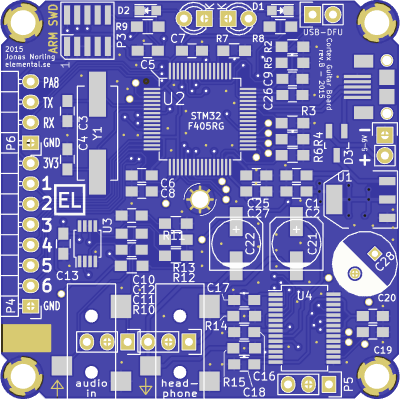
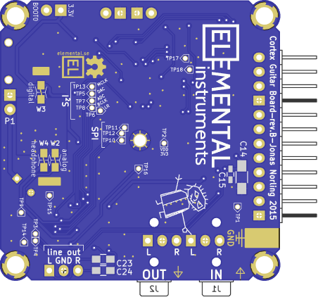

This is a Cortex-M4 DSP board for development of audio DSP
applications such as Guitar effects.

This repository contains the hardware design as KiCAD files and sample
software that implements some naive guitar effects.

The board is based on a STM32F405RG microcontroller (192KiB RAM,
Cortex-M4 with DSP and floating point instructions) and a WM8731 audio
codec.

